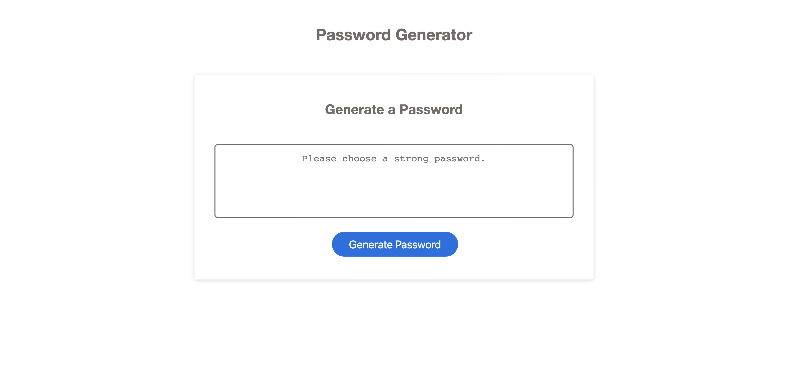

# password-generator

## Acceptance Criteria
- Prompts are presented for password criteria when generating password.
- Select which criteria to include in the password when prompted for password criteria. 
- Choose a password length of at least 8 characters and no more than 128 characters.
- The length of the password prompt will be presented. 
- Character types: confirm whether or not to include lowercase, uppercase, numeric, and/or special characters
- Answering either Yes or No will select at least one character type. 
- Password is generated after all prompts are answered. 
- The random password will be displayed in the box. 

## User Story

AS AN employee with access to sensitive data
I WANT to randomly generate a password that meets certain criteria
SO THAT I can create a strong password that provides greater security.

## What you will find on my website:

Created a landing page which consists of:
- A header that says "Password Generator".
- A button that says "Generate Password".
- An alert prompt asking the desired number of characters for password, with the range of between 8 to 128 characters.
- Prompts asking for the selection (Yes or No) for password criteria.
- Password will be created after answering (Yes or No) for each prompt.
 

## Screenshot of the website

## Technical Checklist: 

Application's links all function correctly.

Application's CSS selectors and properties are consolidated and organized to follow semantic structure.

Application deployed at live URL.

Application loads with no errors.

Application GitHub URL submitted.

GitHub repository contains application code.

## Repository Quality: 

Repository has a unique name (password-generator)

Repository contains multiple descriptive commit messages.

Repository contains quality readme with description, screenshot, link to deployed application.

## Built With

* [HTML](https://developer.mozilla.org/en-US/docs/Web/HTML)
* [CSS](https://developer.mozilla.org/en-US/docs/Web/CSS)
* [Javascript](https://developer.mozilla.org/en-US/docs/Web/JavaScript)
* [Flaticon] (https://www.flaticon.com)

## Deployed Link

* https://chaunnybby7.github.io/password-generator/

## Authors

* **YiLin Ong** 

- [Link to Portfolio Site](https://github.com/chaunnybby7/password-generator)
- [Link to Github](https://github.com/chaunnybby7)
- [Link to LinkedIn](https://www.linkedin.com/in/chauntelleong)

